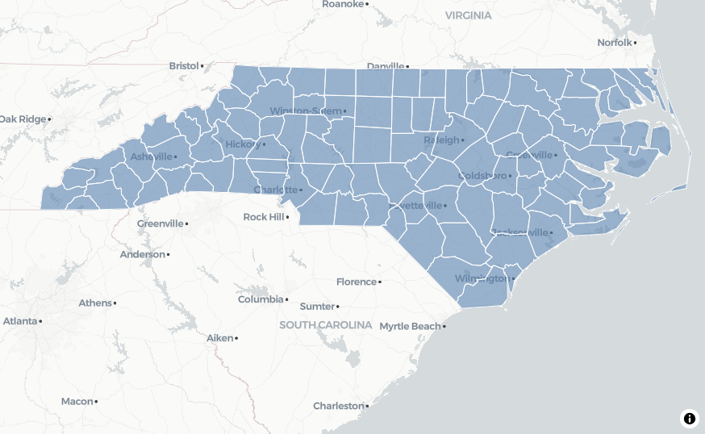

<!-- README.md is generated from README.Rmd. Please edit that file -->

# rtileserver

Vector Tile Server for Spatial Databases in R

## Overview

`rtileserver` provides a lightweight HTTP server for serving Mapbox
Vector Tiles (MVT) from spatial databases including DuckDB and
PostgreSQL/PostGIS. The package enables efficient streaming of spatial
data to web mapping applications using the standard `{z}/{x}/{y}` tile
URL format.

## Installation

``` r
# Install from GitHub
remotes::install_github("arthurgailes/rtileserver")

# Examples require the development version of mapgl:
# remotes::install_github("walkerke/mapgl")
```

## Features

- **Simple API**: Start and stop tile servers with two functions
- **Database agnostic**: Works with any DBI-compatible spatial database
  that supports `ST_AsMVT`
- **Automatic port finding**: Finds available ports automatically or use
  custom ports
- **CORS enabled**: Ready for web mapping applications
- **Lightweight**: Minimal dependencies using httpuv

## Quick Start

This example uses the built-in North Carolina dataset from the `sf`
package - you can run this immediately!

``` r
library(DBI)
library(duckdb)
#> Warning: package 'duckdb' was built under R version 4.5.1
library(sf)
#> Warning: package 'sf' was built under R version 4.5.1
#> Linking to GEOS 3.13.1, GDAL 3.11.0, PROJ 9.6.0; sf_use_s2() is TRUE
library(duckspatial)
#> Warning: package 'duckspatial' was built under R version 4.5.1
# library(rtileserver)
devtools::load_all(".")
#> ℹ Loading rtileserver

# Load North Carolina counties data (built into sf package)
nc <- st_read(system.file("shape/nc.shp", package = "sf"))
#> Reading layer `nc' from data source 
#>   `C:\Users\arthur.gailes\AppData\Local\R\win-library\4.5\sf\shape\nc.shp' 
#>   using driver `ESRI Shapefile'
#> Simple feature collection with 100 features and 14 fields
#> Geometry type: MULTIPOLYGON
#> Dimension:     XY
#> Bounding box:  xmin: -84.32385 ymin: 33.88199 xmax: -75.45698 ymax: 36.58965
#> Geodetic CRS:  NAD27

nc_merc <- st_transform(nc, 3857)

# Create DuckDB connection
con <- dbConnect(duckdb::duckdb(), dbdir = ":memory:")

# Install and load spatial extension using duckspatial
ddbs_install(con)
#> ℹ spatial extension version <a6a607f> is already installed in this database
ddbs_load(con)
#> ✔ Spatial extension loaded

# Write spatial data to DuckDB using duckspatial
ddbs_write_vector(con, nc_merc, "nc_counties", overwrite = TRUE)
#> ℹ Table nc_counties dropped
#> ✔ Table nc_counties successfully imported

# Optional: Create spatial index for better performance
dbExecute(con, "CREATE INDEX idx_nc_geom ON nc_counties USING RTREE (geometry)")
#> [1] 0

# Start tile server
server <- start_tile_server(
  con,
  table_name = "nc_counties",
  geometry_column = "geometry",
  properties = c("NAME", "FIPS", "AREA")
)
#> Tile server running at http://127.0.0.1:8001/
#> Tiles available at: http://127.0.0.1:8001/tiles/{z}/{x}/{y}.pbf

# Server info
print(server)
#> <rtileserver>
#>   Server: http://127.0.0.1:8001/
#>   Tiles:  http://127.0.0.1:8001/tiles/{z}/{x}/{y}.pbf
#>   Table:  nc_counties
# Tiles are now available at server$url
# Use them in mapgl, Leaflet, Mapbox GL JS, etc.
```

## Usage with Web Maps

The tiles can be used with any mapping library that supports Mapbox
Vector Tiles.

### mapgl (R)

Continuing from the Quick Start example:

``` r
library(mapgl)

# Create interactive map
map <- maplibre(
  center = c(-79.5, 35.5),
  zoom = 6,
  style = carto_style("positron")
) |>
  add_vector_source(
    id = "nc-tiles",
    tiles = server$url,
    minzoom = 0,
    maxzoom = 14
  ) |>
  add_fill_layer(
    id = "nc-fill",
    source = "nc-tiles",
    source_layer = "layer",
    fill_color = "steelblue",
    fill_opacity = 0.6,
    tooltip = "NAME"
  ) |>
  add_line_layer(
    id = "nc-outline",
    source = "nc-tiles",
    source_layer = "layer",
    line_color = "white",
    line_width = 1
  )

# Display the map
map
```

<figure>

<figcaption aria-hidden="true">North Carolina counties displayed as
vector tiles</figcaption>
</figure>

When finished, disconnect the server:

``` r
# Clean up when done
stop_tile_server(server, disconnect_db = TRUE)
```

### PostgreSQL/PostGIS Example

``` r
library(RPostgres)
library(rtileserver)

# Connect to PostgreSQL
con <- dbConnect(
  RPostgres::Postgres(),
  dbname = "mydb",
  host = "localhost",
  user = "user",
  password = "password"
)

# Start tile server
server <- start_tile_server(
  con,
  table_name = "my_spatial_table",
  geometry_column = "geom",  # Default is "geometry"
  layer_name = "my_layer"     # Default is "layer"
)

# Use tiles...

# Clean up
stop_tile_server(server, disconnect_db = TRUE)
```

## Requirements

- R \>= 4.0.0
- DBI package
- httpuv package
- A spatial database with `ST_AsMVT` support:
  - DuckDB \>= 1.4.0 with spatial extension
  - PostgreSQL with PostGIS extension

## Data Requirements

- Spatial data should be in **Web Mercator projection (EPSG:3857)** for
  optimal performance
- Tables must have a geometry column (default name: “geometry”)
- Use spatial indexes for better performance

## Function Reference

### `start_tile_server()`

Start a vector tile server.

**Arguments:** - `con`: Database connection object (DBI-compatible) -
`table_name`: Name of the spatial table - `geometry_column`: Geometry
column name (default: “geometry”) - `layer_name`: MVT layer name
(default: “layer”) - `properties`: Character vector of columns to
include (default: NULL = all columns) - `host`: Host address (default:
“127.0.0.1”) - `port`: Port number (default: NULL = auto-detect)

**Returns:** An `rtileserver` object with server information

### `stop_tile_server()`

Stop a running tile server.

**Arguments:** - `server`: An `rtileserver` object - `disconnect_db`:
Whether to disconnect the database (default: FALSE)

**Returns:** NULL (invisibly)

## Performance Tips

1.  **Use spatial indexes**: Create spatial indexes on your geometry
    columns

    ``` sql
    CREATE INDEX idx_geom ON features USING RTREE (geometry);
    ```

2.  **Project to Web Mercator**: Transform data to EPSG:3857 before
    loading

    ``` r
    data_mercator <- sf::st_transform(data, 3857)
    ```

3.  **Limit properties**: Only include necessary columns in tiles

    ``` r
    server <- start_tile_server(con, "features", properties = c("id", "name"))
    ```

4.  **Use appropriate zoom levels**: Set minzoom/maxzoom based on data
    density

## Inspiration

This package was inspired by [Kyle
Walker’s](https://github.com/walkerke) demonstration of serving vector
tiles from DuckDB using the new `ST_AsMVT` function in DuckDB 1.4.0.

## License

MIT

## Contributing

Contributions are welcome! Please feel free to submit issues or pull
requests.
